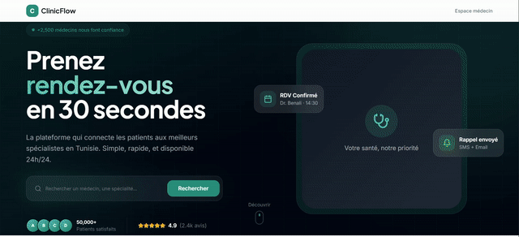

# ClinicFlow SaaS 🏥

**ClinicFlow** is a next-generation healthcare management ecosystem designed to digitize the patient-doctor relationship in Tunisia and North Africa. It bridges the gap between medical professionals and patients through a unified, real-time platform available on Web and Mobile.

> 🌟 **Project Status**: This SaaS platform is an **MVP (Minimum Viable Product)** that is architecturally complete and ready for backend scaling. It is currently "Waiting for Future Development" to integrate live payment gateways and localized SMS gateways.

---

## 🚀 The Vision: A Complete Healthcare Ecosystem

ClinicFlow is not just an appointment booking app; it's a comprehensive SaaS solution built to solve real-world healthcare inefficiencies.

### 💎 Key Value Propositions

* **For Patients**:
  * **Instant Access**: Find specialists by location, specialty, or name in seconds.
  * **24/7 Booking**: Book appointments anytime, without waiting for clinic opening hours.
  * **Unified History**: Keep track of all medical visits and prescriptions in one secure mobile app.
* **For Doctors**:
  * **Digital Cabinet**: Manage appointments, patient files, and schedules from a powerful web dashboard.
  * **Reduced No-Shows**: Automated reminders and easy rescheduling.
  * **Practice Visibility**: Enhanced online presence to attract new patients.

### ✨ Comprehensive Feature Set

#### 🏥 Doctor Portal (Web)

- **Dashboard Analytics**: Real-time overview of patients, appointments, and revenue stats.
* **Smart Calendar**: Drag-and-drop appointment management with daily, weekly, and monthly views.
* **Patient Records**: Centralized database for patient history and contact details.
* **Availability Manager**: Flexible scheduling system to set working hours and breaks.
* **Appointment Request Hub**: Accept, decline, or reschedule incoming booking requests.
* **Reviews Management**: Monitor and respond to patient feedback.

#### 📱 Patient App (Mobile)

- **One-Tap Booking**: Streamlined appointment booking process with instant confirmation.
* **Advanced Search**: Filter doctors by specialty, location, availability, and rating.
* **Doctor Profiles**: Detailed views with bio, location map, and verified patient reviews.
* **My Appointments**: Track upcoming visits and view past consultation history.
* **Secure Authentication**: Robust login/signup flow with profile management.
* **Side Menu Navigation**: Smooth, native drawer for quick access to all app sections.

---

## 🎥 Product Demonstrations

We have captured the full user experience in the following demos.
*Note: These are high-quality recordings located in the `media/` directory of this repository.*

### 📱 Mobile Application (Patient Experience)

*A native Android experience offering smooth navigation, edge-to-edge design, and intuitive booking flows.*

👉 **[Watch Mobile Demo (MP4)](media/mobile-demo.mp4)**

*(Fast-forwarded 2x for quick viewing)*

### 💻 Web Platform (Doctor Portal)

*A comprehensive dashboard for healthcare professionals to manage their practice.*

👉 **[Watch Web Demo (MP4)](media/web-demo.mp4)**

*(Fast-forwarded 4x for quick viewing)*

---

## 🛠️ Technical Architecture

ClinicFlow is built on a modern, scalable "Write Once, Run Everywhere" architecture.

### 📱 Mobile App (`/mobile`)

Built with **React + Capacitor**, delivering a native performance profile without the overhead of maintaining separate Native codebases.

* **Edge-to-Edge Design**: Fully optimized for modern Android immersive modes (transparent system bars).
* **Native Plugins**: Deep integration with hardware (Status Bar, Safe Area, etc.).
* **Optimized Routing**: Custom navigation stack that bypasses marketing pages for instant app entry.

### 💻 Web Platform (`/web`)

A high-performance **React + Vite** Single Page Application (SPA).

* **Modular Component System**: Powered by **Shadcn UI** and **Radix Primitives** for accessibility and robustness.
* **Responsive**: Fluid layouts that adapt from ultra-wide detailed dashboards to mobile web views.
* **State Management**: React Query (TanStack Query) for seamless server-state synchronization.

---

## 🔮 Roadmap & Future Development

This project is structured to scale into a multi-tenant SaaS.

1. **Backend Integration**:
    * Connect the current frontend Mock/Supabase shell to a production Supabase instance with Row Level Security (RLS).
2. **Notification Infrastructure**:
    * Implement Push Notifications via Firebase Cloud Messaging (FCM).
    * Integrate SMS gateway (Twilio/TunisieSMS) for appointment reminders.
3. **Monetization Modules**:
    * **Subscription Logic**: Monthly SaaS tiers for Doctors (Basic vs. Premium visibility).
    * **Transaction Fees**: Small commission on premium booking services.

---

## 📦 Repository Structure

The project uses a clean monorepo structure for easy maintenance.

\`\`\`bash
ClinicFlow-SaaS/
├── mobile/     # 📱 The Native Android Project
│   ├── android/    # Native Android code & config
│   ├── src/        # Shared React Native-like UI code
│   └── capacitor.config.ts
├── web/        # 💻 The Web Dashboard
│   ├── src/        # Dashboard & Landing Page logic
│   └── vite.config.ts
└── media/      # 📸 Demo Assets
\`\`\`

---

*Copyright © 2026 ClinicFlow. All rights reserved.*
